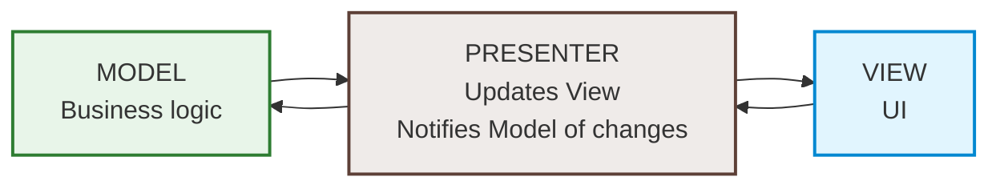
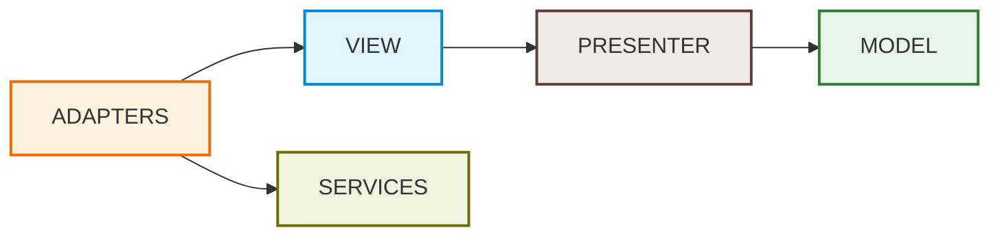

Схема архитектуры MVP

Направление зависимостей

все зависимости однонаправлены (Adapter -> View -> Presenter -> Model), кроме адаптера, который должен зависеть от сервисов.

---

Более подробная схема слоёв приложения с зависимостями

<b>*  ИСКЛЮЧЕНИЕ ИЗ ПОРЯДКА ЗАВИСИМОСТЕЙ</b> 
Окна зависят от AWindow базовой реализации WindowSystem. Так было удобнее инстансить и показывать/прятать окна.
 <b>Как этого можно было избежать</b> 
Перенести базовую реализации WindowSystem в View. Подробнее об этом в разделе OVERENGINEERING

---
<b>Итог:</b> 
Однонаправленные зависимости, модель и презентер даже не знают, что они в Юнити. Это упрощает юнит тестирование, позволяет легко подменять реализации, переиспользовать части кода.    
Отдельно вынес StringMathModule в бизнес логике. Также предполагается что все сервисы переиспользуются в других проектах (и вообще импортируются пакетом без возможности редактирования). Сервисы представляют интерфейс и возможность легко подменять реализации (например IPersistentData можно использовать PlayerPrefs под веб (т.к. на вебе не поддерживается запись в файлы), а под другие платформы могла бы быть реализация с чтением файлов / базы данных и пр.)

---
<b>OVERENGINEERING</b> 
Хорошее упражнение в архитектуре, но очевидный оверинжиниринг для реальных продуктов. Если рассматривать это как архитектуру для проектов компаний, то можно предполагать, что определённые сервисы / фреймворки ВСЕГДА будут использоваться. Нет необходимости абстрагироваться от UniTask, VContainer, сервисов WindowsSystem, PersistentData (т.е. в данном примере можно было вообще обойтись без слоя Адаптеров, если принять за данное, что сервисы у нас будут в каждом проекте и это нормально, что бизнес-логика от них зависит). Можно писать более конкретные сервисы (например WindowsSystem.DefaultRealisation) и зависеть от них.  Софт, разработанный под конкретный фреймворк, всегда будет более оптимизированным, чем абстрактный. А в геймдеве оптимизация очень важна.
 Короче "хорошая" архитектура - это палка о двух концах. Нужно с умом выбирать где действительно нужно потратить время и выделить отдельный модуль / абстракцию, а где нет. 
